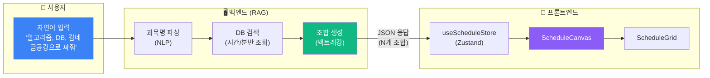
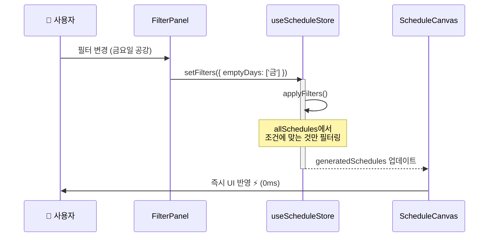
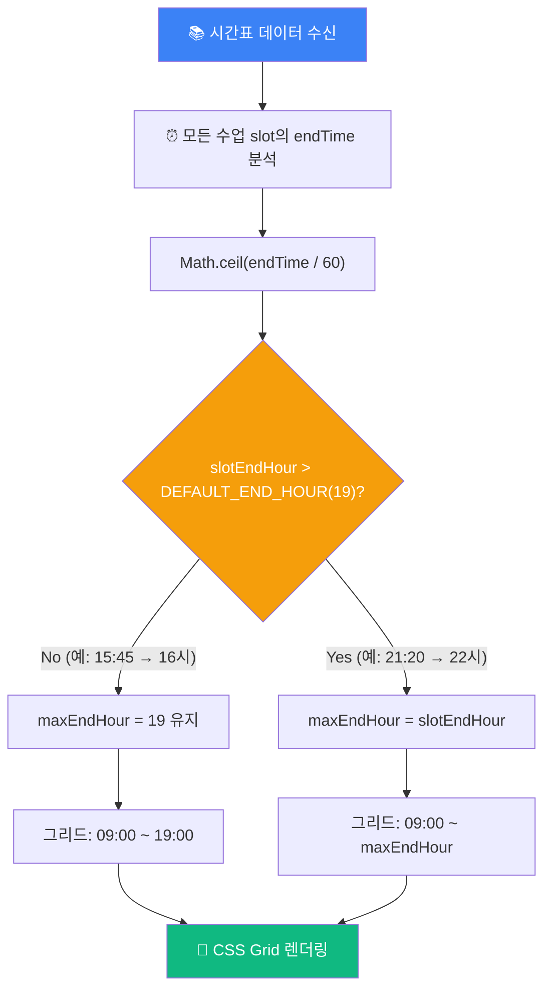

# 시간표 생성 시스템 다이어그램 (핵심 3개)

블로그 포스트에 사용할 **핵심 다이어그램 3개**입니다.
[Mermaid Live Editor](https://mermaid.live/)에서 PNG로 내보내 티스토리에 이미지로 업로드하세요.

---

## 다이어그램 1: 시스템 흐름 (System Flow)

**📍 삽입 위치**: `🏗️ 시스템 아키텍처 및 설계` 섹션 첫 번째 이미지 자리

---

## 다이어그램 2: 상태 관리 흐름 (Sequence Diagram)

**📍 삽입 위치**: `🏗️ 시스템 아키텍처 및 설계` 섹션, 컴포넌트 구조 설명 아래

**핵심 포인트**:

- 사용자 → FilterPanel → Store → Canvas 단방향 흐름
- Store 내부에서 필터링 처리 (API 호출 없음)
- 결과: **0ms 지연**으로 즉각 반영

---

## 다이어그램 3: 동적 그리드 로직 (Flowchart)

**📍 삽입 위치**: `💡 해결책 2: 동적 시간표 그리드` 섹션, 주간/야간 비교 이미지 아래

---

## 📋 체크리스트

| #   | 다이어그램              | 블로그 위치                      | PNG 생성 |
| --- | ----------------------- | -------------------------------- | :------: |
| 1   | 시스템 흐름             | 🏗️ 아키텍처 (첫 번째)            |    ☐     |
| 2   | 상태 관리 흐름 (시퀀스) | 🏗️ 아키텍처 (컴포넌트 설명 아래) |    ☐     |
| 3   | 동적 그리드 로직        | 💡 해결책 2                      |    ☐     |

---

## 사용 방법

1. [Mermaid Live Editor](https://mermaid.live/)에 위 코드 붙여넣기
2. 우측 상단 "Actions" → "PNG" 다운로드
3. 티스토리 에디터에서 해당 `[다이어그램 N: ...]` 위치에 이미지 삽입
